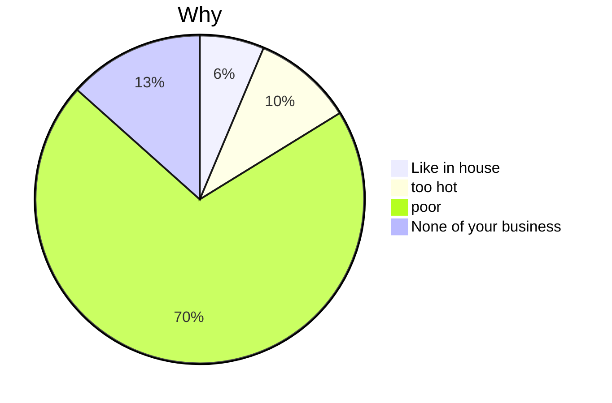
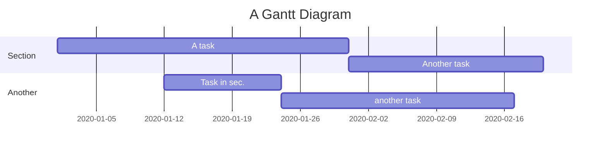
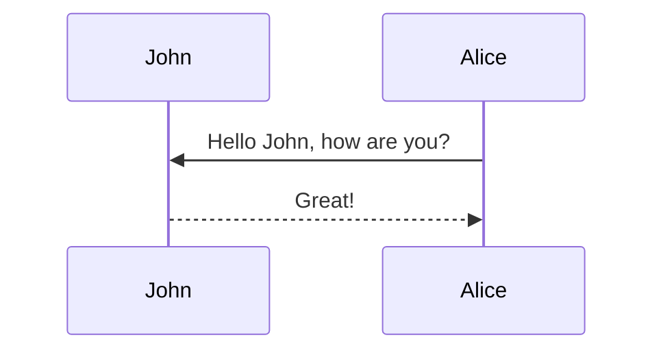

# What is markdown
1. **Markdown** is a lightweight markup language, different from **HTML** (*Hypertext Markup Language*). Markdown's syntax is very simple and easy to get started.
2. **Markdown** writes documents in plain text, depending on the keyboard rather than mouse, focusing on the writing itself, and feeling the charm of writing.
3. **Markdown** uses some simple identifiers, which lets the text have properly format.
4. The key property of **Markdown** is ***Delete numerous and refine***
5. **Markdown** is the best carrier for both notes and web articles. 

# Markdown Grammar
## 1. Title & Outline
---
### 1.1 Title
* Markdown has six levels of titles, just like HTML
* Distinguish from level one title to level six title
	* Title:
		* #* number of level + `space` + text
```markdown
# Heading 1
## Heading 2
### Heading 3
#### Heading 4
##### Heading 5
###### Heading 6
```

### 1.2 Outline
- Format of Outline:
	- Inputting `[toc]` at the top of a file, it will automatically generate a *Table of Content* corresponding to all the titles
- Not all markdown editor support `[toc]` (regretfully, not supported in Obsidian, and also this post)
```markdown
[toc]
```

But to add a outline for this blog post. Simply add

```yml
toc:
  beginning: true
```

Also, if you want to have a table of content in the sidebar, simply add

```yml
toc:
  sidebar: left
```

At this time, you will see the outline both at the beginning of the post and the sidebar.

## 2. Italics & Bold
---
### 2.1 Italics
- Format of *Italics*
	1. `*` + text + `*`
	2. `_` + text +`_`

```markdown
*This is italics*
_This is also italics_
```

### 2.2 Bold
- Format of **Bold**
	1. `**` + text + `**`
	2. `__` + text + `__`

```markdown
**Bold text**
__Bold text__
```

### 2.3 Bold Italics
- Format of ***Bold Italics***
  - `***` + text + `***`

```markdown
***Bold italics***
___Bold italics___
**_Bold italics_**
```

### 2.4 Italics containing Bold & Bold containing Italics
```markdown
plain text

*This is italics **Containing Bold** words*

**This is Bold *Containing Italics* words**
```

## 3. Line
---
### 3.1 Horizontal dashed line
- Format
	- `***`
	- `---`

```markdown
---
***

```

### 3.2 Delete line
- Format
	- `~~` + text + `~~`

```markdown
~~this~~
```
~~What I want to delete~~

### 3.3 Underline
- Format
	- `<u>` + text + `</u>`

Same as HTML

```markdown
<u>this is underline</u>
```
<u>Underline</u>

## 4. List & Quotation
---
### 4.1 Ordered list
`1.` + `space` + text
```markdown
1. first thing
2. second thing
3. third thing
```
1. IIII `Enter`
2. IIIIIII' `Enter`
3. IIIIIII `shift + Enter` `(<br> for html)`(to write at next line in the same order)<br>
	ok this is on the same order

### 4.2 Unordered list
`-` or `*`  + `space` + text
```markdown
- list
- list 2
- list 3
* list 4
* list 5
```

### 4.3 Quotation
- Format
	- `>` + text (no space here)

>This is a quotation <br>
>Add another paragraph with `<br>`

### 4.4 Indent & Backspace
- Indent
	1. `Tab`
	2. `ctrl` + `]`(Windows)
	3. `command` + `]` (MacOS)
- Backspace
	1. `Shift + Tab`
	2. `ctrl` + `[`
	3. `command` + `[`
- Quotation Indent && Backspace
>1. The first 
>	1. Still the first but indent to next level
>	2. The second thing
>2. The second back to the first level

### 4.5 Custom Quotation

These custom styles can be used by adding the specific class to the blockquote, as follows:

```markdown
> ##### TIP
>
> A tip can be used when you want to give advice
> related to a certain content.
{: .block-tip }
```
> ##### TIP
>
> A tip can be used when you want to give advice
> related to a certain content.
{: .block-tip }

```markdown
> ##### WARNING
>
> This is a warning, and thus should
> be used when you want to warn the user
{: .block-warning }
```

> ##### WARNING
>
> This is a warning, and thus should
> be used when you want to warn the user
{: .block-warning }

```markdown
> ##### DANGER
>
> This is a danger zone, and thus should
> be used carefully
{: .block-danger }
```

> ##### DANGER
>
> This is a danger zone, and thus should
> be used carefully
{: .block-danger }

## 5. Web Link & Image
---
### 5.1 Web link
- Format
	- `[` + text + `]` + `(` + url + `space` + `"` + information + `"` + `)`

```markdown
[Google](www.google.com "press control and click linking to google")
```

[Google](https://www.google.com "jumping to google")

### 5.2 Image link
- Format
	- Add a `!` before web link format
	- but not good for the html post

use

```html
<div class="col-sm mt-3 mt-md-0">
    
</div>
```

<div class="col-sm mt-3 mt-md-0">
    
</div>

## 6. Table
---
- Format
	- `|` is the frame
	- `-` to distinguish head and main
	- `:` to control alignment of text content

```markdown
| Head 1 | Head 2 | Head 3 |
| ------: | :------: | :------ |
| Element1| Element2| Element3|
```

| Head 1     | Head 2 | Head 3 |
|:---------- |:------:| ------:|
| OK<br>mmmm |   HA   |     GJ |
| MO         | XXXXX  |     IO |


You can see above, that :--- control to left aligned, :--: middle aligned, ---: right aligned

If you want to change to a new line in table, you can use `<br>`

### 6.1 Complex table

By using [Bootstrap Table](https://bootstrap-table.com/) it is possible to create pretty complex tables, with pagination, search, and more. For example, the following HTML code will display a table, loaded from a JSON file, with pagination, search, checkboxes, and header/content alignment. For more information, check the [documentation](https://examples.bootstrap-table.com/index.html).



```html
<table
  data-click-to-select="true"
  data-height="460"
  data-pagination="true"
  data-search="true"
  data-toggle="table"
  data-url="{{ '/assets/json/table_data.json' | relative_url }}"
>
  <thead>
    <tr>
      <th data-checkbox="true"></th>
      <th data-field="id" data-halign="left" data-align="center" data-sortable="true">ID</th>
      <th data-field="name" data-halign="center" data-align="right" data-sortable="true">Item Name</th>
      <th data-field="price" data-halign="right" data-align="left" data-sortable="true">Item Price</th>
    </tr>
  </thead>
</table>
```



<table
  data-click-to-select="true"
  data-height="460"
  data-pagination="true"
  data-search="true"
  data-toggle="table"
  data-url="{{ '/assets/json/table_data.json' | relative_url }}">
  <thead>
    <tr>
      <th data-checkbox="true"></th>
      <th data-field="id" data-halign="left" data-align="center" data-sortable="true">ID</th>
      <th data-field="name" data-halign="center" data-align="right" data-sortable="true">Item Name</th>
      <th data-field="price" data-halign="right" data-align="left" data-sortable="true">Item Price</th>
    </tr>
  </thead>
</table>

## 7. Code Block
---
### 7.1 Inline Code
- Format
	- `This is the example`

### 7.2 Code Block
- Format

```markdown
This is called Markdown block
```

```python
for magician in magicians:
	print(magician.title())
```

### 7.3 Code with line number

If you want to display line numbers for a specific code block, all you have to do is wrap your code in a liquid tag:


 <br/> code code code <br/> 


The keyword `linenos` triggers display of line numbers.
Produces something like this:



int main(int argc, char const \*argv[])
{
string myString;

    cout << "input a string: ";
    getline(cin, myString);
    int length = myString.length();

    char charArray = new char * [length];

    charArray = myString;
    for(int i = 0; i < length; ++i){
        cout << charArray[i] << " ";
    }

    return 0;

}



## 8. To-do
---
- Format
	- `-` + `space` + `[` + `space` + `]` + to-do
	- check between two square brackets to complete a to-do

```markdown
- [ ] to-do 1
- [x] to-do 2
```

- [ ] to-do 1
- [x] to-do 2

We can use tapping two times `command + Enter` to quickly add a to-do format in Obsidian.

## 9. Footnote
---
This is an equation called Maxwell equation[^1].
[^1]: Equation 1 here

For html

```html
Some text with a footnote.<sup><a href="#fn1" id="ref1">1</a></sup>
<sup id="fn1">1. [Text of footnote 1]<a href="#ref1" title="Jump back to footnote 1 in the text.">↩</a></sup>
```

Some text with a footnote.<sup><a href="#fn1" id="ref1">1</a></sup>

<sup id="fn1">1. [Text of footnote 1]<a href="#ref1" title="Jump back to footnote 1 in the text.">↩</a></sup>

## 10. Latex
---
### 10.1 Inline equation
- Format
	- `$$` + inline-equation + `$$`
	- For markdown in other software, just use one dollar symbol `$`

Example: $$x^2 + 2x +5 + \sqrt x = \frac{1}{x}$$

### 10.2 Equation Block
- Format

```markdown
$$
E = mc^2
$$
```

Example:

$$
K_{GRW}(G, H)=\sum_{l=0}^\infty[(I-\gamma A_\times)^{-1}]_{ij}
$$

You can also use `\begin{equation}...\end{equation}` instead of `$$` for display mode math.
MathJax will automatically number equations:

\begin{equation}
\label{eq:cauchy-schwarz}
\left( \sum_{k=1}^n a_k b_k \right)^2 \leq \left( \sum_{k=1}^n a_k^2 \right) \left( \sum_{k=1}^n b_k^2 \right)
\end{equation}

and by adding `\label{...}` inside the equation environment, we can now refer to the equation using `\eqref`.

Like \eqref{eq:cauchy-schwarz}

## 11. Mermaid







## 12. Disqus Comments (DEPRECATED)

To add disqus comments for blog post, simply add

```yml
disqus_comments: true
```

## 13. Giscus Comments

To add giscus comments for blog post, simply add

```yml
giscus_comments: true
```