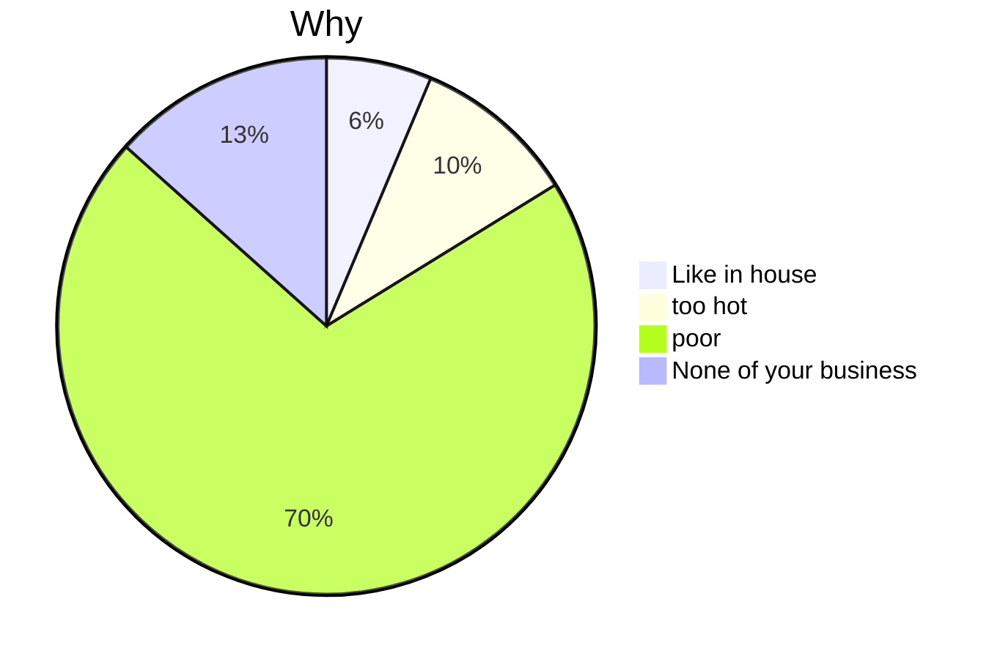
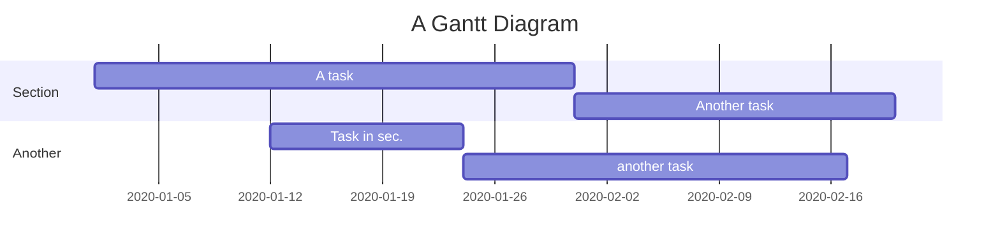

# What is markdown
1. **Markdown** is a lightweight markup language, different from **HTML** (*Hypertext Markup Language*). Markdown's syntax is very simple and easy to get started.
2. **Markdown** writes documents in plain text, depending on the keyboard rather than mouse, focusing on the writing itself, and feeling the charm of writing.
3. **Markdown** uses some simple identifiers, which lets the text have properly format.
4. The key property of **Markdown** is ***Delete numerous and refine***
5. **Markdown** is the best carrier for both notes and web articles. 

# Markdown Grammar
## 1. Title & Outline
---
### 1.1 Title
* Markdown has six levels of titles, just like HTML
* Distinguish from level one title to level six title
	* Title:
		* #* number of level + `space` + text
```markdown
# Heading 1
## Heading 2
### Heading 3
#### Heading 4
##### Heading 5
###### Heading 6
```

### 1.2 Outline
- Format of Outline:
	- Inputting `[toc]` at the top of a file, it will automatically generate a *Table of Content* corresponding to all the titles
- Not all markdown editor support `[toc]` (regretfully, not supported in Obsidian)
```markdown
[toc]
```

## 2. Italics & Bold
---
### 2.1 Italics
- Format of *Italics*
	1. `*` + text + `*`
	2. `_` + text +`_`
```markdown
*This is italics*
_This is also italics_
```

### 2.2 Bold
- Format of **Bold**
	1. `**` + text + `**`
	2. `__` + text + `__`
```markdown
**Bold text**
__Bold text__
```

### 2.3 Bold Italics
``***`` + text + ```***```
```markdown
***Bold italics***
___Bold italics___
**_Bold italics_**
```

### 2.4 Italics containing Bold & Bold containing Italics
```markdown
plain text

*This is italics **Containing Bold** words*

**This is Bold *Containing Italics* words**
```

## 3. Line
---
### 3.1 Horizontal dashed line
- Format
	- `***`
	- `---`
```markdown
---
***

```
### 3.2 Delete line
- Format
	- `~~` + text + `~~`
```markdown
~~this~~
```
~~What I want to delete~~

### 3.3 Underline
- Format
	- `<u>` + text + `</u>`
Same as HTML
```markdown
<u>this is underline</u>
```
<u>Underline</u>

## 4. List & Quotation
---
### 4.1 Ordered list
`1.` + `space` + text
```markdown
1. first thing
2. second thing
3. third thing
```
1. IIII `Enter`
2. IIIIIII' `Enter`
3. IIIIIII `shift + Enter`(to write at next line in the same order)
	ok this is on the same order

### 4.2 Unordered list
`-` or `*`  + `space` + text
```markdown
- list
- list 2
- list 3
* list 4
* list 5
```

### 4.3 Quotation
- Format
	- `>` + text (no space here)
>This is a quotation
>Add another paragraph with `Enter`

### 4.4 Indent & Backspace
- Indent
	1. `Tab`
	2. `ctrl` + `]`(Windows)
	3. `command` + `]` (MacOS)
- Backspace
	1. `Shift + Tab`
	2. `ctrl` + `[`
	3. `command` + `[`
- Quotation Indent && Backspace
>1. The first 
	>1. Still the first but indent to next level
	>2. The second
>2. The second back to the first level

## 5. Web Link & Image
---
### 5.1 Web link
- Format
	- `[` + text + `]` + `(` + url + `space` + `"` + information + `"` + `)`
```markdown
[Google](www.google.com "press control and click linking to google")
```
[Google](https://www.google.com "jumping to google")

### 5.2 Image link
- Format
	- Add a `!` before web link format

## 6. Table
---
- Format
	- `|` is the frame
	- `-` to distinguish head and main
	- `:` to control alignment of text content
```markdown
| Head 1 | Head 2 | Head 3 |
| ------: | :------: | :------ |
| Element1| Element2| Element3|
```

| Head 1     | Head 2 | Head 3 |
|:---------- |:------:| ------:|
| OK<br>mmmm |   HA   |     GJ |
| MO         | XXXXX  |     IO |


You can see above, that :--- control to left aligned, :--: middle aligned, ---: right aligned

If you want to change to a new line in table, you can use `<br>` in words

## 7. Code Block
---
### 7.1 Inline Code
- Format
	- `This is the example`

### 7.2 Code Block
- Format
```markdown
This is called Markdown block
```

```python
for magician in magicians:
	print(magician.title())
```

## 8. To-do
---
- Format
	- `-` + `space` + `[` + `space` + `]` + to-do
	- check between two square brackets to complete a to-do
```markdown
- [ ] to-do 1
- [x] to-do 2
```
- [ ] to-do 1
- [x] to-do 2

We can use tapping two times `command + Enter` to quickly add a to-do format in Obsidian.

## 9. Footnote
---
This is an equation called Maxwell equation[^1].
[^1]: Equation 1 here

## 10. Latex
---
### 10.1 Inline equation
- Format
	- `$` + inline-equation + `$`
Example: $x^2 + 2x +5 + \sqrt x = \frac{1}{x}$

### 10.2 Equation Block
- Format
	- `$$`
		 +text + text
		`$$`

Example:
$$
K_{GRW}(G, H)=\sum_{l=0}^\infty[(I-\gamma A_\times)^{-1}]_{ij}
$$

## 11. Mermaid



